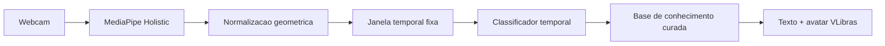

# Totem Aju

Totem interativo de acessibilidade comunicacional em **Libras** para turistas
surdos em Aracaju, Sergipe.

Projeto prático da disciplina de Inteligência Artificial, na linha de **Visão
Computacional** aplicada a **fomento ao turismo e preservação cultural**.

## O problema

Pessoas surdas que visitam Aracaju não têm como obter informação turística
básica — onde fica um banheiro, como chegar à Orla de Atalaia, qual ônibus tomar
— em sua própria língua. A acessibilidade comunicacional em espaços públicos não
é uma cortesia: é obrigação prevista na Lei de Libras (10.436/2002) e na Lei
Brasileira de Inclusão (13.146/2015).

O totem atende os dois sentidos da comunicação:

| Sentido | Solução |
| --- | --- |
| Turista surdo → totem | Reconhecimento de sinais em Libras por visão computacional (contribuição técnica deste trabalho) |
| Totem → turista surdo | [VLibras](https://www.gov.br/governodigital/pt-br/vlibras) traduzindo a resposta para Libras num avatar 3D, junto com o texto em português |

## Como funciona



Em vez de trabalhar com pixels crus, o pipeline extrai *landmarks* de mãos, corpo
e face e os normaliza geometricamente. Isso reduz drasticamente a quantidade de
dados necessária e permite operação em tempo real na CPU, sem GPU dedicada.

O recorte do problema é deliberado: **vocabulário fechado** de 26 sinais do
domínio turístico, em vez de Libras contínua irrestrita (que é problema de
pesquisa aberto). Ver [`docs/vocabulario-sinais.md`](docs/vocabulario-sinais.md).

## Documentação

| Documento | Conteúdo |
| --- | --- |
| [`docs/adr/0001-descartar-virtual-human-toolkit-e-unity.md`](docs/adr/0001-descartar-virtual-human-toolkit-e-unity.md) | Por que não usamos o Virtual Human Toolkit nem Unity |
| [`docs/arquitetura.md`](docs/arquitetura.md) | Camadas, responsabilidades e cronograma |
| [`docs/vocabulario-sinais.md`](docs/vocabulario-sinais.md) | Os 26 sinais e as regras de coleta |
| [`docs/terminologia-e-etica.md`](docs/terminologia-e-etica.md) | Terminologia correta, riscos éticos e diretrizes CAPES/MEC |

## Requisitos

**Python 3.12.** O MediaPipe não publica wheels para 3.13 nem 3.14, e compilar
da fonte no Windows não é viável. O 3.12 conviverá sem conflito com outras
versões já instaladas.

## Instalação (Windows / PowerShell)

```powershell
winget install Python.Python.3.12

git clone <url-do-repositorio>
cd totem-aju

py -3.12 -m venv .venv
.\.venv\Scripts\Activate.ps1

pip install -r requirements.txt
pip install -r requirements-dev.txt
pip install -e .
```

Se o `Activate.ps1` for bloqueado pela política de execução:

```powershell
Set-ExecutionPolicy -Scope CurrentUser RemoteSigned
```

Em Linux ou macOS, troque a ativação por `source .venv/bin/activate`.

> **Não instale `opencv-python`.** O MediaPipe já depende de
> `opencv-contrib-python`, e as duas distribuições instalam o mesmo módulo
> `cv2`, sobrescrevendo uma à outra.

## Coleta de dados

O vocabulário e a contagem de repetições:

```powershell
totem-capture --list-signs
```

Gravando 20 repetições de um sinal:

```powershell
totem-capture --sign banheiro --signer seu_nome --repetitions 20
```

O parâmetro `--signer` é **obrigatório e importa**: a divisão entre treino e
teste precisa ser feita por pessoa. Se quadros da mesma pessoa caírem nos dois
conjuntos, o modelo aprende a reconhecer a pessoa em vez do sinal, e a acurácia
relatada fica inflada por vazamento de dados.

As amostras vão para `data/`, que é ignorada pelo git: são arquivos binários
grandes e podem conter dados pessoais identificáveis.

Ao gravar, enquadre cabeça e tronco com folga nas bordas para as mãos, e varie
iluminação, distância e fundo entre as sessões. O CLI avisa quando uma amostra
teve baixa taxa de detecção, indicando enquadramento ruim.

## Desenvolvimento

A suíte de testes cobre apenas lógica pura e **não exige MediaPipe nem webcam**,
então roda em qualquer máquina da equipe:

```powershell
pip install -r requirements-dev.txt
pytest
```

Lint e formatação:

```powershell
ruff check .
ruff format .
```

### Estrutura

```
src/totem_aju/
  config.py                   constantes compartilhadas por coleta e treino
  vocabulary.py               vocabulário fechado (contrato de dados)
  errors.py                   exceções de domínio
  vision/
    schema.py                 FrameLandmarks (imutável, tipado)
    extractor.py              Protocol LandmarkExtractor
    mediapipe_extractor.py    implementação concreta (único módulo que vê MediaPipe)
    camera.py                 Protocol FrameSource + webcam via OpenCV
    normalization.py          funções puras de normalização geométrica
    sequence.py               janela temporal e reamostragem
  data/
    manifest.py               índice das amostras em JSON Lines
    recorder.py               orquestra captura → disco
  cli/
    capture.py                interface de coleta
```

O MediaPipe e o OpenCV ficam atrás de `Protocol`, com import preguiçoso nas
implementações concretas. Isso é o que permite testar todo o pipeline com dublês
sintéticos e trabalhar no projeto sem ter a captura configurada. Detalhes em
[`docs/arquitetura.md`](docs/arquitetura.md).

## Situação atual

Concluído: fundação do projeto, pipeline de extração e normalização de landmarks,
coleta de dados com indexação, e 106 testes automatizados.

Próximas etapas: treino do classificador temporal, base de conhecimento
turístico, integração do VLibras e interface de quiosque.

## Licença

MIT. Ver [`LICENSE`](LICENSE).
