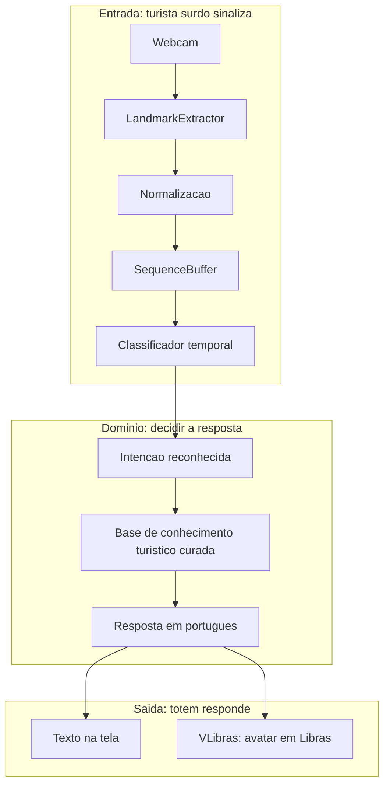
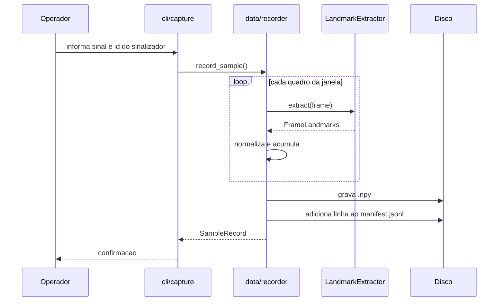

# Arquitetura do Totem Aju

## Visão geral

O totem é composto por um monitor com touchscreen, uma webcam e um computador.
O software se divide em três camadas com fronteiras bem definidas:



## Princípio estruturante: o domínio não conhece a infraestrutura

A regra que orienta a organização do código é a **inversão de dependência**:
a lógica de negócio depende de abstrações, nunca de bibliotecas concretas.

Concretamente, `vision/extractor.py` define um `Protocol`:

```python
class LandmarkExtractor(Protocol):
    def extract(self, frame: NDArray[np.uint8]) -> FrameLandmarks: ...
```

E `vision/mediapipe_extractor.py` é uma implementação desse contrato, que importa
o MediaPipe **de forma preguiçosa**, dentro do construtor.

Isso não é preciosismo arquitetural; resolve três problemas concretos:

1. **MediaPipe não instala em qualquer Python.** Só há wheels para 3.9–3.12.
   Com o import preguiçoso, a suíte de testes e toda a lógica de pré-processamento
   rodam em qualquer versão, sem MediaPipe instalado.
2. **Testes não podem depender de webcam.** Um `FakeExtractor` que devolve
   landmarks sintéticos permite testar o pipeline inteiro de forma determinística.
3. **A equipe trabalha em paralelo.** Quem cuida do classificador não precisa ter
   a captura funcionando na sua máquina.

## Camadas e responsabilidades

| Módulo | Responsabilidade | Não sabe sobre |
| --- | --- | --- |
| `vision/schema.py` | Estrutura de dados de um quadro de landmarks | Webcam, MediaPipe, disco |
| `vision/extractor.py` | Contrato de extração | Qualquer implementação concreta |
| `vision/mediapipe_extractor.py` | Adaptar MediaPipe ao contrato | Normalização, dataset |
| `vision/normalization.py` | Funções puras de normalização geométrica | Webcam, tempo, disco |
| `vision/sequence.py` | Acumular quadros numa janela temporal | O que é um sinal |
| `data/manifest.py` | Registro persistente das amostras | O que é um landmark |
| `data/recorder.py` | Orquestrar captura para o disco | MediaPipe (recebe o Protocol) |
| `cli/capture.py` | Interação com o operador da coleta | Regras de normalização |

## Por que normalizar os landmarks

O MediaPipe devolve coordenadas relativas ao quadro da imagem. Isso significa que
o *mesmo* sinal produz vetores completamente diferentes se a pessoa estiver mais
à esquerda ou mais distante da câmera. Sem tratamento, o modelo gastaria dados
aprendendo a ignorar posição e distância.

A normalização aplicada é geométrica e determinística:

1. **Translação:** subtrair a posição do pulso, tornando o pulso a origem.
2. **Escala:** dividir pela distância pulso–base do dedo médio, tornando a
   representação invariante ao tamanho da mão na imagem.

O efeito prático é reduzir drasticamente a quantidade de dados necessária — o que
é exatamente o que viabiliza o projeto num semestre. Como são funções puras, as
duas propriedades (invariância a translação e a escala) são verificadas
diretamente por testes unitários.

## Por que reamostrar a sequência

Duas pessoas executam o mesmo sinal em durações diferentes, e a mesma pessoa varia
entre repetições. O classificador, porém, exige tensores de formato fixo.

O `SequenceBuffer` mantém uma janela deslizante e produz sempre uma sequência de
comprimento canônico (`SEQUENCE_LENGTH`) por interpolação linear ao longo do eixo
temporal, preservando o primeiro e o último quadro.

## Por que o manifest registra o sinalizador

Cada amostra gravada anota o identificador de quem sinalizou. Isso é obrigatório,
não opcional: no treino, a divisão entre treino e teste precisa ser feita **por
pessoa**. Se quadros da mesma pessoa aparecerem nos dois conjuntos, o modelo
reconhece a pessoa em vez do sinal, e a acurácia relatada no artigo estaria
inflada por vazamento de dados — um erro metodológico grave e fácil de cometer.

O formato é JSON Lines (`manifest.jsonl`), append-only: uma amostra por linha.
Se a coleta for interrompida com Ctrl+C, perde-se no máximo a última linha, em
vez de corromper um JSON inteiro.

## Fluxo de dados da coleta



## Decisões de plataforma

O descarte do Virtual Human Toolkit e do Unity está registrado em
[`adr/0001-descartar-virtual-human-toolkit-e-unity.md`](adr/0001-descartar-virtual-human-toolkit-e-unity.md).

Ambiente: **Python 3.12** (limite imposto pelo MediaPipe), dependências fixadas
em `requirements.txt`, ambiente virtual em `.venv`.

## Cronograma

| Período | Entrega |
| --- | --- |
| até 03/09 | Checkpoint: equipe, tema e justificativa definidos |
| setembro | Coleta do dataset e pipeline de extração de landmarks |
| outubro | Treino e avaliação do classificador; integração do VLibras |
| início de novembro | Montagem do quiosque e testes com usuários surdos |
| 23–25/11 | Apresentação final e artigo |

## Fora do escopo desta fase

Treino do classificador, back-end FastAPI, integração do VLibras e front-end de
quiosque. A fundação e a coleta vêm primeiro porque **dado é o caminho crítico**:
sem amostras gravadas, nenhuma das etapas seguintes pode começar.
