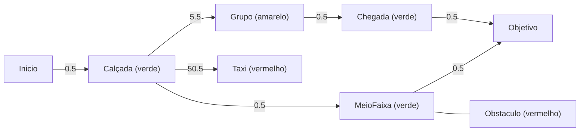
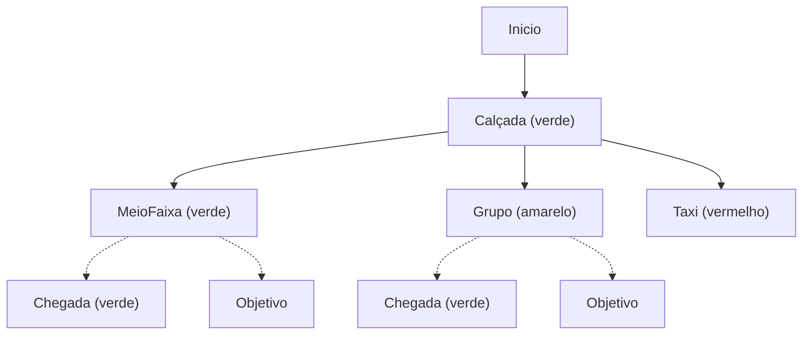
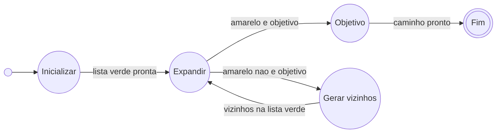

# Atividade de IA: Agentes no cruzamento ES-01 (Barcelona)

**Disciplina:** COMP0506 - Fundamentos da Inteligência Artificial  
**Período / turma:** 2026.2 - T04  
**Frames:** sequência ES-01  
**Agentes:** Pedestre, Motorista e Semáforo Inteligente  

**Membros do grupo**

| Nome | Matrícula |
| --- | --- |
| Breno Murilo Alexandre Reis Santos | 202100022701 |
| Guilherme Rosário Alves | 202100022784 |
| James Pereira Matos | 202200014130 |
| João Filipe de Araujo Santos Rezende | 202100011548 |
| Manoel Victor Lima Monteiro | 202000012972 |

Cenário: cruzamento urbano em Barcelona, com faixa de pedestres, táxis e semáforos.

---

## Parte 1. PEAS e classificação do ambiente

### Contexto

Nos frames, táxis circulam na via, pedestres atravessam a faixa ou andam nas calçadas, e o semáforo define a preferência de passagem. O PEAS (*Performance, Environment, Actuators, Sensors*) descreve cada agente; em seguida classificamos o ambiente (Russell e Norvig).

### PEAS

| Agente | Performance | Ambiente | Atuadores | Sensores |
| --- | --- | --- | --- | --- |
| **Pedestre** | Atravessar sem colisão, respeitar sinalização, reduzir espera | Faixa, calçadas, veículos, outros pedestres, semáforo, postes, árvores, abrigo | Passos, mudança de direção, gestos, botão de pedestre | Visão, audição, propriocepção |
| **Motorista** | Seguir sem acidente, respeitar semáforo e pedestre, manter fluidez | Via, faixa de táxi, pedestres, sinalização, iluminação | Volante, acelerador, freio, marcha, seta, farol, buzina | Visão, espelhos, painel, audição (e assistência, se houver) |
| **Semáforo Inteligente** | Segurança, menos espera nos dois fluxos, evitar ciclo vazio | Cruzamento, filas, grupos de pedestres, fase atual | Cores do sinal, tempo de fase, sinal de pedestre | Câmeras/frames, laços/radar, botão ou presença, relógio |

O pedestre e o motorista só veem o entorno local. O semáforo não se desloca: controla o direito de passar.

### Classificação do ambiente

| Dimensão | Classificação | Justificativa |
| --- | --- | --- |
| Observabilidade | **Parcialmente observável** | Ninguém vê o cruzamento inteiro; há oclusão, ponto cego e intenções ocultas. |
| Agentes | **Multiagente cooperativo** | Pedestre, motorista e semáforo interagem; o objetivo comum é segurança, não soma zero. |
| Determinismo | **Estocástico** | A mesma ação não leva sempre ao mesmo resultado (hesitação, freio tarde, ruído de sensor). |
| Dinâmica | **Dinâmico** | Enquanto um agente decide, pedestres e veículos já mudaram de posição. |
| Discretização | **Contínuo** | Posição, velocidade e tempo são grandezas reais; as cores do semáforo são só o atuador. |

---

## Parte 2. Dinâmica e comportamentos sociais

### Interação com a multidão

O semáforo libera a travessia; o motorista (táxi) espera enquanto há gente na faixa; os pedestres negociam espaço entre si e com obstáculos na boca da calçada.

### Força social

Os valores não são arbitrários. Vêm de três bases cruzadas:

1. **Proxêmica (Edward Hall):** a distância pessoal entre estranhos costuma ficar entre cerca de 0,45 m e 1,2 m. Acima disso entra a distância social mais “pública”. Por isso adotamos **0,8 m a 1,2 m** como faixa de conforto mínima entre pedestres que não andam juntos: ainda está dentro da zona pessoal, mas já é o ponto em que a maioria desvia ou reduz o passo.
2. **Modelo de força social (Helbing e Molnár):** a ideia útil aqui é a *repulsão*: o desconforto cresce quando outro pedestre se aproxima. No modelo original isso aparece como potencial/força que decai com a distância (parâmetro de alcance da ordem de décimos de metro), não como um limiar mágico. Usamos o conceito (manter afastamento de desconhecidos) e calibramos o limiar operacional com a proxêmica e com os frames.
3. **Geometria do corpo e os frames ES-01:** a largura típica de ombros de um adulto fica perto de **0,4 m a 0,5 m**. Abaixo disso, dois estranhos já estão no limite de encostar. Nos frames, estranhos na faixa deixam um vão visível da ordem de um passo (~1 m); famílias e pares (adulto com criança, casais) ficam bem mais perto, o que a literatura trata como atração social, não como falha da regra.

Em síntese prática: **0,8–1,2 m** = conforto entre estranhos; **0,4–0,5 m** = risco de contato físico; grupos íntimos são exceção e, para os demais, valem como bloco a contornar.

### Prioridade de passagem

Os trechos mais apertados da cena são o cruzamento de fluxos na faixa e a entrada da calçada (postes, árvores, abrigo).

- Quem já está no meio da travessia mantém o impulso; o isolado desvia do grupo maior.
- Fluxos opostos resolvem com desvio lateral curto, não parando no asfalto.
- Com pedestres na faixa, o táxi cede; quando a faixa esvazia, o veículo retoma. O semáforo organiza essa troca.

### Impacto do histórico (Agente X)

O **Agente X** é um pedestre isolado fácil de seguir nos frames (ex.: casaco vermelho ou escuro). Por volta de 000110–000140 ele avançava com trajetória estável e “lembrava” que o vizinho vinha reto. Quando o vizinho muda de direção de um frame para o outro, o histórico (posições e sentido recentes) permite reduzir o passo ou abrir um desvio antes da distância cair abaixo de 0,8 m. Sem memória, cada quadro seria um mundo novo e a correção chegaria tarde.

---

## Parte 3. Busca A* para a rota do Agente X

X sai do **início** (calçada de origem) e quer o **objetivo** (calçada oposta). O A* escolhe o caminho de menor **f(n) = g(n) + h(n)** num grafo discreto da cena.

O que o A* precisa contornar ou respeitar não é só pedestre: entram também o **Semáforo Inteligente** (fase da travessia) e o **Motorista** (táxi na via). X continua sendo quem a busca roteia; semáforo e motorista moldam o mapa de custos.

### Grafo

A conversão do espaço contínuo dos frames usa uma **grade de 0,5 m × 0,5 m** sobre faixa e calçadas. Cada célula transitável vira um nó; arestas ligam até 8 vizinhos.

O valor **0,5 m** não é arbitrário: na Parte 2, essa é a ordem da largura de ombros de um adulto e do limiar em que dois estranhos já estão no risco de contato físico (0,4 m a 0,5 m). A célula da grade tem aproximadamente o “espaço de um corpo”. Assim, um nó vermelho (táxi, obstáculo, colisão) ocupa cerca de uma pessoa, e o passo ortogonal de uma célula à outra custa **0,5** (em metros). Na diagonal, o comprimento é 0,5 × √2 ≈ **0,71**.

As cores do semáforo organizam o mapa:

| Cor | Significado no grafo |
| --- | --- |
| **Verde** | Célula transitável para X (fase de pedestre, sem conflito) |
| **Amarelo** | Célula de atenção (perto de grupo / penalidade social) |
| **Vermelho** | Célula bloqueada ou proibitiva (obstáculo, táxi, fase de veículo) |

No grafo do frame entram:

| Elemento | Efeito no grafo |
| --- | --- |
| Obstáculo fixo (poste, árvore, abrigo) | Nó vermelho (bloqueado) |
| Outros pedestres / grupo | Nó amarelo (penalidade social; vermelho se d < 0,4 m) |
| **Motorista** (táxi) | Nó vermelho (+50), quase colisão |
| **Semáforo Inteligente** | Fase de pedestre deixa a faixa verde; fase de veículo pinta a via de vermelho |

O recorte da faixa no frame Y vira um grafo ponderado, com custos nas arestas. Custo ortogonal base: **0,5**; diagonal: **≈ 0,71**. `Calçada`, `MeioFaixa` e `Chegada` são células verdes (transitáveis) em posições distintas do cruzamento. `Grupo` é amarelo (+5). `Taxi` e `Obstaculo` são vermelhos.

**Grafo da faixa (recorte)**, fase de pedestre; táxi fora do caminho útil ou já cedeu:

Leitura: o contorno `Inicio - Calçada (verde) - MeioFaixa (verde) - Objetivo` soma 1,5. O atalho pelo `Grupo (amarelo)` soma 7,0. Passar pelo `Taxi (vermelho)` custa 50,5 só na primeira aresta e é descartado. O `Obstaculo (vermelho)` não liga ao objetivo. O A* fica com o contorno pelas células verdes.

Se o semáforo estiver em fase de veículo, as arestas que cruzam a via ficam vermelhas e X espera na calçada até o mapa voltar ao verde.

**Árvore de busca parcial** (depois de expandir `Calçada`):

Papel na busca (cores do semáforo) e nós envolvidos:

- **Lista vermelha** (já expandidos): Inicio, Calçada (verde)  
- **Lista verde** (candidatos): MeioFaixa (verde), Grupo (amarelo), Taxi (vermelho)  
- Ainda não gerados: Chegada (verde), Objetivo, Obstaculo (vermelho)  

Entre os candidatos, `MeioFaixa (verde)` tem o menor f(n); `Grupo (amarelo)` e `Taxi (vermelho)` ficam para trás pelo g alto. A próxima expansão segue o contorno.

### Máquina de estados da busca A*

A máquina abaixo é do **algoritmo A\*** (como a busca opera), não do motorista nem do semáforo. Esses dois agentes não são estados da busca: eles **atualizam o grafo** entre frames (fase luminosa, posição do táxi). X só replaneja quando o mapa muda.

Conjuntos da busca, no vocabulário do semáforo:

- **Lista verde**: candidatos ainda não expandidos  
- **Lista amarela**: nó escolhido agora para expandir (menor f)  
- **Lista vermelha**: nós já expandidos  

**Tabela de transição**

| Estado atual | Condição (entrada) | Próximo estado |
| --- | --- | --- |
| Inicializar | início colocado na lista verde | Expandir |
| Expandir | nó amarelo é o objetivo | Objetivo |
| Expandir | nó amarelo não é o objetivo | Gerar vizinhos |
| Gerar vizinhos | vizinhos atualizados na lista verde | Expandir |
| Objetivo | caminho reconstruído | Fim |

**Diagrama de estados** (círculos no estilo clássico; a condição rotula a seta):

Leitura: o laço Expandir / Gerar vizinhos é o miolo do A*. Só sai desse laço quando o nó amarelo (menor f(n)) é o objetivo; aí a busca encerra e devolve o caminho do início até o objetivo.

### g(n): custo real

**g(n) = distância acumulada + penalidade social + penalidade do veículo**

- Aresta ortogonal: 0,5 m; diagonal: ≈ 0,71 m.
- Penalidade p(n) até o pedestre mais próximo: 0 se d ≥ 1,2 m; +1 se 0,8 ≤ d < 1,2; +5 se 0,4 ≤ d < 0,8; +50 se d < 0,4.
- Célula sob o táxi (vermelho): +50.
- Fase de veículo no semáforo: células da via vermelhas (não entram como vizinhos válidos).

Exemplo: 6 passos ortogonais + 2 diagonais = 4,42 m; duas células com +1 resultam em **g(n) = 6,42**. Uma célula amarela (+5) sobe para 9,42. Uma célula vermelha do táxi (+50) torna o ramo inviável frente ao contorno verde.

### h(n): heurística

**h(n)** = distância euclidiana do centro da célula n até o objetivo. Sem obstáculos no caminho restante, não superestima o custo geométrico. Penalidades de pedestre, táxi e bloqueio por fase ficam em g(n) (ou na geração de vizinhos), para não estragar a admissibilidade de h.

### f(n) no frame Y

No **frame Y ≈ 000110**, com fase de pedestre (faixa verde) e um grupo amarelo no meio, atravessar o grupo deixa h baixo, mas g (e f) sobe. Contornar pelas células verdes aumenta um pouco a distância, corta a penalidade e deixa **f menor**. A lista verde expande o menor f primeiro e desvia do amarelo. Se o semáforo pintar a via de vermelho no meio do caminho, o grafo muda e X replaneja.

---

## Referências

HALL, Edward T. *The Hidden Dimension*. Garden City: Doubleday, 1966.

HART, Peter E.; NILSSON, Nils J.; RAPHAEL, Bertram. A formal basis for the heuristic determination of minimum cost paths. *IEEE Transactions on Systems Science and Cybernetics*, v. 4, n. 2, p. 100-107, 1968.

HELBING, Dirk; MOLNÁR, Péter. Social force model for pedestrian dynamics. *Physical Review E*, v. 51, n. 5, p. 4282-4286, 1995.

RUSSELL, Stuart; NORVIG, Peter. *Artificial Intelligence: A Modern Approach*. 4. ed. Pearson, 2020.
